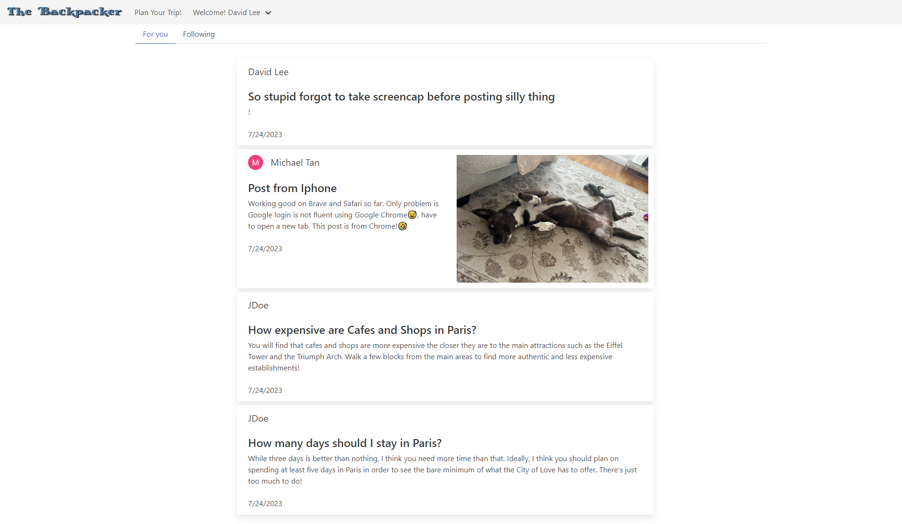

# The Backpacker

 

## Project Overview

An integrated trip planning platform for professional travelers. It is an all-in-one travel sharing venue/blog where AI can randomly generate travel destinations/maps 

## User Story

For those who want to travel and share their travel experience, this is a social platform for all travelers to express their traveling experiences by posting comments, tips and pictures! It also provide the option to plan a travel itinerary, created using Amadeus RESTful API, on the traveller choices of departure location, destination and departure date. 

## Tech stack

  

  
  
   
 

### The practical knowledge that we gain through this project:

- Java Script Coding and DOM.
- Css styles
- Creating layouts and page design
- Express
- Using APIs and creating requests to external urls

## Deployment link on Heroku 

https://guarded-headland-26840-8a69e6da1e2d.herokuapp.com/

## Screenshots

## License  

This project is licensed under the [MIT license](LICENSE).  

## Credits  

### Collaborators

* [Marie Luron](https://github.com/mluron-ArxFjs)
* [Saeeda Batool](https://github.com/Saeeda14)
* [Lukas Zimmermann](https://github.com/mastalukeremix)

### Acknowledgments

* [Traversy Media](https://www.youtube.com/watch?v=SBvmnHTQIPY)

## Questions  

If you have any questions about the repository, open an issue or contact me directly at [m.tan1230@gmail.com](mailto:m.tan1230@gmail.com). You can find more of my work at [Mtan1230](https://github.com/Mtan1230).
